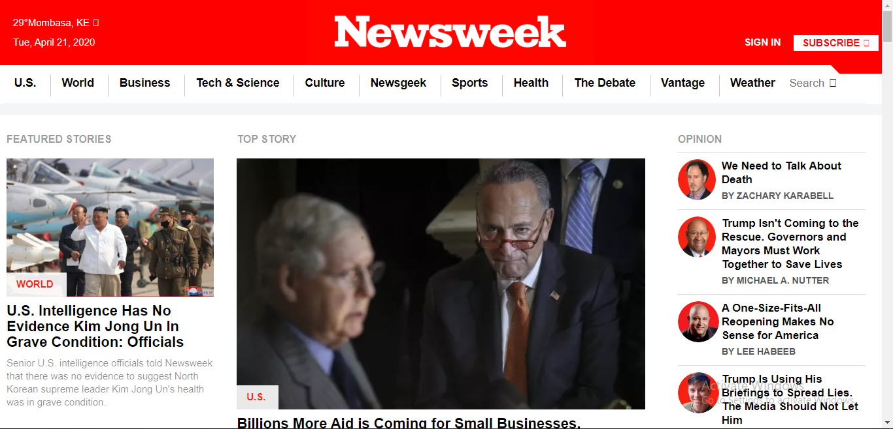

# Newsweek clone

In this project, i got the chance to try out Twitter’s Bootstrap framework by building a site that actually uses it – <a href="http://www.newsweek.com/">Newsweek.</a>

Here's the screenshot of our work

Here's a <a href="https://rawcdn.githack.com/imhilla/newsweek/bdb56709a47ddda0ba81df72ab5344187e219dc3/index.html">live link</a>

Here is how the page is structured:
The page is divided into three main sections as below;

- the header section which encloses the logo and the navigation. The navigation was achieved by using flex values for CSS display property on unordered lists and background images. Media queries were used to create headers for different widths on mobile, tablet and laptop. The bars in the header on mobile were created using CSS styles. The header content on mobile is different from content on the tablet and laptop and this was achieved using media queries.
- the main section which comprises of five sections that wrap articles. The articles were arranged mainly using grid and flex displays. The main section was created to render well on the mobile, tablet and laptop widths using media queries and bootstap.
- the footer section comprises the navigation and copyright sections. These were styled to render well on mobile, tablet and laptop.

Built With

- HTML,
- CSS,
- Javascript
- Google Chrome Developer tools,

## Authors

👤 **Kiptoo Hillary**

- Github: [@githubhandle](https://github.com/imhilla)
- Twitter: [@twitterhandle](https://twitter.com/hillarykiptoo_)
- Linkedin: [linkedin]()
- Email: [Email](hillaryodhiambo282@gmail.com)

🤝 Contributing
Contributions, issues and feature requests are welcome!

Show your support
Give a ⭐️ if you like this project!
